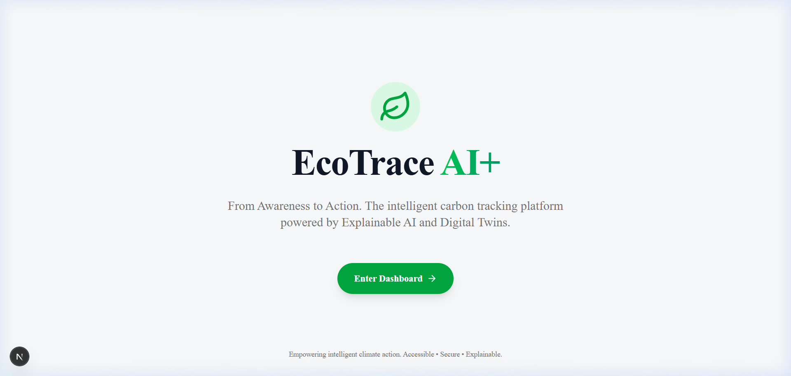
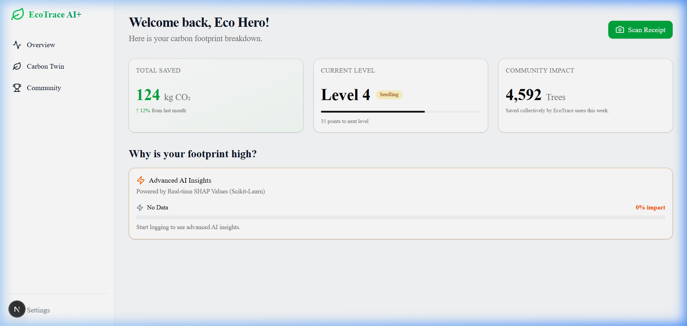
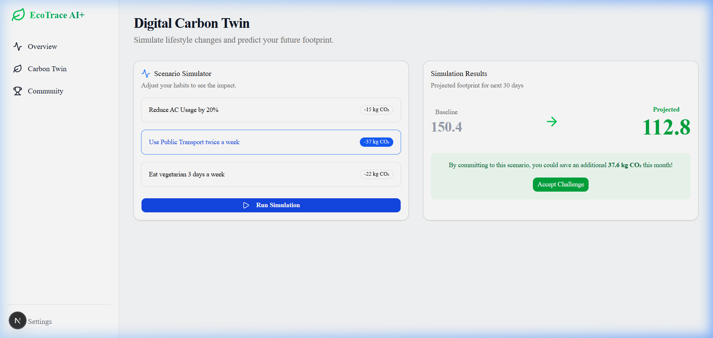
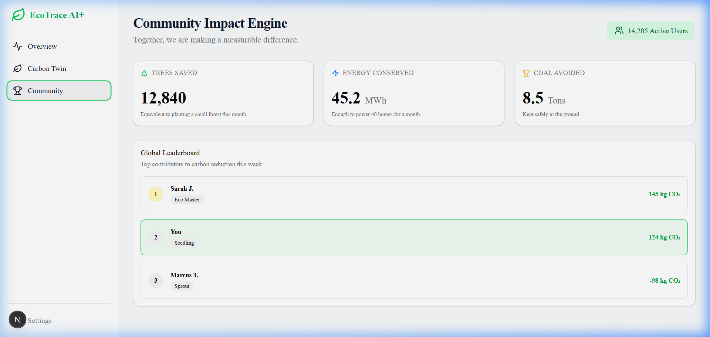

# 💻 EcoTrace AI+ Frontend (Next.js PWA)

> **The production-grade client-side application for the EcoTrace AI+ carbon tracking platform, built with Next.js 16 and Tailwind CSS.**

[](https://nextjs.org)
[](https://tailwindcss.com)
[](https://typescriptlang.org)
[](https://github.com/pmndrs/zustand)
[](https://web.dev/explore/progressive-web-apps)

The EcoTrace AI+ frontend provides a responsive, accessible, and high-performance Progressive Web Application dashboard, visual charts, and simulators designed to guide users from climate awareness to concrete action.

---

## 📱 Running Prototype Screens

| 🌐 High-Impact Landing Page | 📊 SHAP Explainable AI Insights |
| :---: | :---: |
|  |  |
| **💡 Carbon Twin Scenario Simulator** | **🏆 Global Community Impact** |
|  |  |

---

## ✨ Design Philosophy & UI/UX Features

- **Modern Glassmorphism Design**: Incorporates dark-mode compatible translucent card interfaces, smooth micro-animations, and custom gradient accents using the Tailwind CSS engine.
- **Explainable AI Insights**: Uses progress bars and interactive widgets to break down the exact impact contribution of user consumption habits.
- **Responsive PWA Layout**: Optimised for installation on both desktop and mobile devices. Supports responsive grid modules that adjust elegantly across all device screen aspect ratios.
- **Accessibility & Compliance**: Focuses on WCAG guidelines, utilizing proper HTML5 semantic markup, keyboard focus states, navigation skip-links, and descriptive ARIA roles.

---

## 🛠️ Technology Stack

- **Framework**: Next.js 16 (App Router)
- **State Store**: Zustand (caches local carbon logs, user configuration, and tokens)
- **Data Visualizations**: Recharts
- **Icons**: Lucide React
- **Styling**: Tailwind CSS + custom glassmorphic overrides
- **Primitives**: `@base-ui/react` and `class-variance-authority`

---

## 🚀 Getting Started

### Prerequisites
- Node.js (v18+ recommended)
- A running instance of the EcoTrace FastAPI backend (details in the root [README](../README.md))

### 1. Install Dependencies
```bash
npm install
```

### 2. Launch Development Server
```bash
npm run dev
```
Open [http://localhost:3000](http://localhost:3000) to view the client dashboard.

---

## 📁 Key File Structure

```
frontend/
├── public/                 # Icons, screenshots, manifest assets
└── src/
    ├── app/
    │   ├── dashboard/      # Layout and main dashboard pages
    │   │   ├── community/  # Community challenges and global leaderboards
    │   │   ├── twin/       # Scenario-based Digital Carbon Twin simulator
    │   │   └── page.tsx    # SHAP explanations and current level logs
    │   ├── globals.css     # CSS root setup and Tailwind imports
    │   ├── layout.tsx      # Application shell configuration
    │   └── page.tsx        # Responsive landing page
    ├── components/
    │   └── ui/             # Reusable core visual primitives (cards, buttons, progress bar)
    └── lib/
        └── api.ts          # Asynchronous backend fetch wrapper
```

---

## ☁️ Railway Deployment

Deploying the client-side Next.js PWA to Railway requires simple configurations:
1. Create a service in Railway linked to this GitHub repository.
2. Configure **Root Directory** to `frontend`.
3. In the **Variables** tab, add:
   - `NEXT_PUBLIC_API_URL`: Set this to your deployed FastAPI backend URL (e.g., `https://your-backend-service.up.railway.app/api/v1`).
4. Railway will automatically build and serve the production-ready Next.js client using Nixpacks.

---

## 🔗 Backend Ingestion & Routes
The client interfaces with the FastAPI backend endpoints via `src/lib/api.ts`:
- `GET /carbon/insights` → Populates category contribution progress bars using actual SHAP values.
- `POST /carbon/twin/simulate` → Feeds input parameters to the time-series forecasting model and updates the projections card.
- `POST /carbon/receipt` → Dispatches image files for OCR processing and classifications.

---

*Developed with 💚 by the EcoTrace AI*
